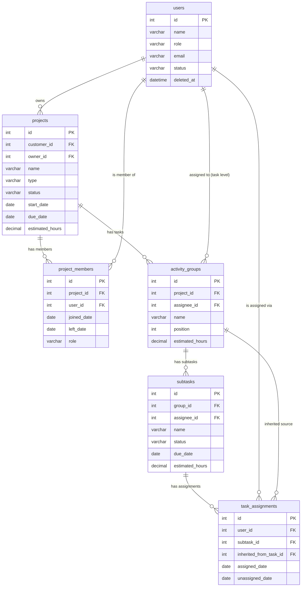

# Design Document: Assignment and Project Membership Architecture

## Overview

This design covers the backend implementation for the Assignment and Project Membership Architecture feature in Kanvance — a Node.js/Express + MySQL project management SaaS.

The feature introduces six tightly-coupled capabilities:

1. **Project Membership** — a `project_members` table tracking who belongs to each project, with soft-leave semantics.
2. **Task-Level Assignment** — `activity_groups.assignee_id` propagates to child subtasks that have no direct assignment.
3. **Effective Owner Resolution** — a deterministic priority chain (Active_Assignment → task assignee → project owner) used by all analytics and timesheet queries.
4. **Multi-Assignee Subtasks** — `task_assignments` becomes the authoritative multi-user assignment store; `subtasks.assignee_id` is kept only for backward compatibility.
5. **Bulk and Auto-Distribution** — manager-facing APIs to assign or spread subtasks in bulk.
6. **Assignment History** — all assignment changes are preserved via soft-unassign rather than deletion.

### Design Principles

- **Backward compatibility first** — `subtasks.assignee_id` is never removed; it mirrors the first active assignee.
- **Soft-delete everywhere** — no assignment or membership row is ever hard-deleted.
- **Membership gate** — every write-assignment API validates Active_Member status before touching `task_assignments`.
- **Effective owner at query time** — ownership is resolved in SQL; no denormalised cache column is written.

---

## Architecture

### Layered Structure

The feature follows the existing Kanvance pattern: **Router → Controller → Service → Model**.

```
Express Router
    │
    ├─ project.routes.js          (existing — extend with /members, /assignable-users)
    ├─ group.routes.js            (existing — extend with /bulk-assign, /distribute; PATCH assignee_id)
    └─ subtask.routes.js          (existing — extend /assignment-history)

Controllers (new or extended)
    ├─ projectMember.controller.js   (new)
    ├─ group.controller.js           (extend — assignee_id, bulk-assign, distribute)
    └─ subtask.controller.js         (extend — assignee_ids sync, assignment-history)

Services (new or extended)
    ├─ projectMember.service.js      (new)
    ├─ assignment.service.js         (new — shared assignment logic, effective owner)
    ├─ group.service.js              (extend — task-level assignment propagation)
    └─ subtask.service.js            (extend — multi-assignee sync)

Models (new or extended)
    ├─ projectMember.model.js        (new)
    ├─ assignment.model.js           (new — task_assignments CRUD + effective owner SQL)
    └─ group.model.js                (extend — assignee_id column)
```

### Dependency Graph

```
projectMember.service  ──▶  projectMember.model
                        ──▶  assignment.model (Active_Member check helper)

group.service          ──▶  group.model
                        ──▶  assignment.service (propagation, bulk-assign, distribute)
                        ──▶  projectMember.service (Active_Member validation)

subtask.service        ──▶  subtask.model
                        ──▶  assignment.service (multi-assignee sync)
                        ──▶  projectMember.service (Active_Member validation)

assignment.service     ──▶  assignment.model
analytics.model        ──▶  (uses Effective_Owner SQL fragment inline)
timesheetEntries.model ──▶  (uses Effective_Owner SQL fragment inline)
```

---

## Components and Interfaces

### New API Endpoints

| Method   | Path                                           | Handler                          | Auth Required |
|----------|------------------------------------------------|----------------------------------|---------------|
| `POST`   | `/api/projects/:projectId/members`             | `projectMember.addMember`        | MANAGER+      |
| `DELETE` | `/api/projects/:projectId/members/:userId`     | `projectMember.removeMember`     | MANAGER+      |
| `GET`    | `/api/projects/:projectId/members`             | `projectMember.listMembers`      | MANAGER+      |
| `GET`    | `/api/projects/:projectId/assignable-users`    | `projectMember.assignableUsers`  | MANAGER+      |
| `PATCH`  | `/api/groups/:taskId`                          | `group.update` (extended)        | requireAuth   |
| `POST`   | `/api/groups/:taskId/bulk-assign`              | `group.bulkAssign`               | MANAGER+      |
| `POST`   | `/api/groups/:taskId/distribute`               | `group.distribute`               | MANAGER+      |
| `PATCH`  | `/api/subtasks/:id`                            | `subtask.update` (extended)      | requireAuth   |
| `GET`    | `/api/subtasks/:id/assignment-history`         | `subtask.assignmentHistory`      | MANAGER+      |

> Note: Existing endpoints use `PUT`; the new subtask multi-assignee endpoint uses `PATCH` as a semantic alias. The router will support both verbs on the same handler to avoid breaking existing clients.

### Existing Endpoints Modified

| Endpoint                          | Change                                                                               |
|-----------------------------------|--------------------------------------------------------------------------------------|
| `GET /api/projects/:projectId`    | Each subtask gains `effective_assignee_id`, `effective_assignee_name`, `inherited`, `assignees[]` |
| `GET /api/analytics/team-utilisation` | Subtask aggregation uses Effective_Owner SQL fragment                            |
| `GET /api/timesheet-entries/grid` | `task_assignments` join expands to include inherited ownership (Effective_Owner)     |

---

## Data Models

### New Table: `project_members`

```sql
CREATE TABLE IF NOT EXISTS project_members (
  id           INT          AUTO_INCREMENT PRIMARY KEY,
  project_id   INT          NOT NULL,
  user_id      INT          NOT NULL,
  joined_date  DATE         NOT NULL,
  left_date    DATE         DEFAULT NULL,
  role         VARCHAR(50)  NOT NULL DEFAULT 'member',
  UNIQUE KEY   uq_project_user (project_id, user_id),
  CONSTRAINT   fk_pm_project FOREIGN KEY (project_id) REFERENCES projects(id)  ON DELETE CASCADE,
  CONSTRAINT   fk_pm_user    FOREIGN KEY (user_id)    REFERENCES users(id)      ON DELETE CASCADE
);
```

**Design decisions:**
- The `UNIQUE KEY uq_project_user` enforces one row per (project, user) pair. Re-joining after a soft-leave is handled by setting `left_date = NULL`, not inserting a second row.
- `role` stores project-level role (`member`, `lead`, `contributor`) — distinct from the system `users.role` (`ADMIN`, `MANAGER`, etc.).
- `ON DELETE CASCADE` on both FKs avoids orphan rows when a project or user is hard-deleted.

### Column Addition: `activity_groups.assignee_id`

```sql
ALTER TABLE activity_groups
  ADD COLUMN assignee_id INT DEFAULT NULL,
  ADD CONSTRAINT fk_ag_assignee FOREIGN KEY (assignee_id) REFERENCES users(id) ON DELETE SET NULL;
```

`ON DELETE SET NULL` means if the assigned user is hard-deleted, the task simply loses its assignee rather than blocking the delete.

### Column Addition: `task_assignments.unassigned_date`

```sql
ALTER TABLE task_assignments
  ADD COLUMN unassigned_date DATE DEFAULT NULL;
```

An `Active_Assignment` is a row where `unassigned_date IS NULL`. Setting this field to `CURRENT_DATE` performs a soft-unassign without destroying the history row.

### Column Addition: `task_assignments.inherited_from_task_id`

```sql
ALTER TABLE task_assignments
  ADD COLUMN inherited_from_task_id INT DEFAULT NULL,
  ADD CONSTRAINT fk_ta_inherited FOREIGN KEY (inherited_from_task_id)
    REFERENCES activity_groups(id) ON DELETE SET NULL;
```

This column marks which `task_assignments` rows were created by task-level propagation. It is set when the assignment originates from `PATCH /api/groups/:taskId` propagation, and `NULL` when created by direct subtask assignment. This allows the un-assign path (`assignee_id: null` on the task) to target only inherited rows.

### Full Schema Diagram (post-migration)



---

## Service Layer

### `projectMember.service.js`

```
addMember(projectId, { user_id, role })
  1. Verify project exists → 404
  2. Verify user exists → 404
  3. Check for existing Active_Member row (left_date IS NULL) → 409
  4. INSERT project_members or UPDATE left_date = NULL if prior row exists
  5. Return created record

removeMember(projectId, userId)
  1. Find Active_Member row → 404 if none
  2. UPDATE left_date = CURRENT_DATE
  3. Return { removed: true }

listMembers(projectId)
  1. Verify project exists → 404
  2. SELECT all project_members JOIN users, ORDER BY (left_date IS NULL) DESC, joined_date ASC
  3. Return array

assignableUsers(projectId)
  1. Verify project exists → 404
  2. SELECT Active_Members with user_name, ordered by user_name ASC
  3. If zero members found, fall back to project owner (backward-compat)
  4. Return array

isActiveMember(projectId, userId)         ← shared helper used by other services
  Returns boolean
```

### `assignment.service.js` (new shared service)

```
syncAssignees(subtaskId, assigneeIds, projectId)
  1. Validate all assigneeIds are Active_Members (or bypass for no-member projects — owner only)
  2. Fetch current Active_Assignments for subtask
  3. Compute: to_add = assigneeIds - current; to_remove = current - assigneeIds
  4. Soft-unassign to_remove (SET unassigned_date = CURRENT_DATE)
  5. INSERT new rows for to_add (assigned_date = CURRENT_DATE, inherited_from_task_id = NULL)
  6. UPDATE subtasks.assignee_id = assigneeIds[0] ?? NULL
  7. Return { added, removed }

propagateTaskAssignment(taskId, assigneeId)
  1. Fetch all child subtask IDs for taskId
  2. For each child subtask without an Active_Assignment for assigneeId:
     - INSERT task_assignments (assigned_date = CURRENT_DATE, inherited_from_task_id = taskId)
     using ON DUPLICATE KEY UPDATE logic to avoid inserting if already exists
  3. Return count of newly inserted rows

clearInheritedAssignments(taskId)
  1. UPDATE task_assignments SET unassigned_date = CURRENT_DATE
     WHERE inherited_from_task_id = taskId AND unassigned_date IS NULL
  2. Return affected rows count

bulkAssign(taskId, userId, projectId)
  1. Validate task exists → 404
  2. Validate user exists → 404
  3. Validate user is Active_Member → 422
  4. Fetch all child subtask IDs
  5. For subtasks where Active_Assignment differs: soft-unassign old
  6. Insert/preserve Active_Assignment for userId on all subtasks
  7. UPDATE subtasks.assignee_id = userId for all children
  8. UPDATE activity_groups.assignee_id = userId
  9. Return { task_id, user_id, subtasks_assigned }

distribute(taskId, mode, userIds, assignments, projectId)
  1. Validate task exists → 404
  2. Validate mode in { round_robin, equal, manual } → 400
  3. Validate userIds not empty → 400
  4. Validate all userIds are Active_Members → 422
  5. If mode = manual, validate all subtask_ids belong to taskId → 422
  6. Compute distribution map (subtask_id → user_id) per mode
  7. For each (subtask, user): soft-unassign existing if different user; insert/preserve assignment
  8. Return { task_id, mode, distribution }

computeDistribution(subtasks, userIds, mode)
  round_robin: subtask[N] → userIds[N % userIds.length]
  equal:       chunk subtasks into N groups of floor(total/users); remainder subtasks → lower-index users
  manual:      use provided assignments array directly
```

### `group.service.js` Extensions

```
update(taskId, data)   ← existing, extended
  If assignee_id is present in data:
    1. Fetch current activity_groups.assignee_id
    2. If new value equals current → return early (no-op)
    3. If new value is null → clearInheritedAssignments(taskId)
    4. If new value is non-null:
       a. Validate user exists → 404
       b. Validate user is Active_Member of parent project → 422
       c. UPDATE activity_groups.assignee_id = new value
       d. propagateTaskAssignment(taskId, assigneeId)
  Proceed with existing name/position update logic
```

### `subtask.service.js` Extensions

```
update(id, data)   ← existing, extended
  If assignee_ids present:
    1. Resolve projectId for the subtask
    2. syncAssignees(id, assignee_ids, projectId)
  Else if assignee_id present (legacy):
    Treat as assignee_ids = [assignee_id] or [] for null
    Call syncAssignees accordingly
  Continue existing audit log and status recalc logic
```

---

## SQL Query Patterns for Effective_Owner Resolution

### The Effective_Owner SQL Fragment

This reusable SQL expression resolves the effective owner for a given subtask. It is embedded inline in any query that needs ownership attribution. It must **not** be cached — it reads live database state every time.

```sql
-- Effective_Owner_Resolver (scalar subquery pattern)
-- Returns the user_id of the effective owner for subtask s.id

COALESCE(
  -- (1) Active_Assignment: latest assigned user with unassigned_date IS NULL
  (SELECT ta.user_id
   FROM task_assignments ta
   WHERE ta.subtask_id = s.id
     AND ta.unassigned_date IS NULL
   ORDER BY ta.assigned_date DESC, ta.id DESC
   LIMIT 1),

  -- (2) Task-level assignee (activity_groups.assignee_id)
  ag.assignee_id,

  -- (3) Project owner fallback
  p.owner_id

) AS effective_owner_id
```

The corresponding name can be resolved with a LEFT JOIN or correlated subquery:

```sql
-- Companion name resolver (add to SELECT after joining ag and p)
COALESCE(
  (SELECT u_ta.name
   FROM task_assignments ta2
   JOIN users u_ta ON u_ta.id = ta2.user_id
   WHERE ta2.subtask_id = s.id
     AND ta2.unassigned_date IS NULL
   ORDER BY ta2.assigned_date DESC, ta2.id DESC
   LIMIT 1),
  u_ag.name,
  u_proj.name
) AS effective_owner_name
```

Where the query includes:
```sql
LEFT JOIN users u_ag   ON u_ag.id   = ag.assignee_id
LEFT JOIN users u_proj ON u_proj.id = p.owner_id
```

### `GET /api/projects/:projectId` — Subtask Query (updated)

```sql
SELECT
  s.id, s.group_id, s.name, s.status, s.due_date,
  s.assignee_id,   -- kept for backward compat
  s.flag_type, s.flag_reason, s.flag_waiting_on, s.position,

  -- Effective owner (priority chain)
  COALESCE(
    (SELECT ta.user_id FROM task_assignments ta
     WHERE ta.subtask_id = s.id AND ta.unassigned_date IS NULL
     ORDER BY ta.assigned_date DESC, ta.id DESC LIMIT 1),
    ag.assignee_id,
    p.owner_id
  ) AS effective_assignee_id,

  COALESCE(
    (SELECT u_ta.name FROM task_assignments ta
     JOIN users u_ta ON u_ta.id = ta.user_id
     WHERE ta.subtask_id = s.id AND ta.unassigned_date IS NULL
     ORDER BY ta.assigned_date DESC, ta.id DESC LIMIT 1),
    u_ag.name,
    u_proj.name
  ) AS effective_assignee_name,

  -- inherited flag: false when Active_Assignment exists, true when inherited, null when no owner
  CASE
    WHEN EXISTS (
      SELECT 1 FROM task_assignments ta
      WHERE ta.subtask_id = s.id AND ta.unassigned_date IS NULL
    ) THEN FALSE
    WHEN ag.assignee_id IS NOT NULL OR p.owner_id IS NOT NULL THEN TRUE
    ELSE NULL
  END AS inherited

FROM subtasks s
JOIN activity_groups ag ON ag.id = s.group_id
JOIN projects p         ON p.id  = ag.project_id
LEFT JOIN users u_ag    ON u_ag.id   = ag.assignee_id
LEFT JOIN users u_proj  ON u_proj.id = p.owner_id
WHERE s.group_id IN (/* group ids for project */)
ORDER BY s.position
```

The `assignees` array (multi-assignee) is fetched in a separate query and merged in the service layer:

```sql
SELECT ta.subtask_id, ta.user_id, u.name AS user_name
FROM task_assignments ta
JOIN users u ON u.id = ta.user_id
WHERE ta.subtask_id IN (/* subtask ids */)
  AND ta.unassigned_date IS NULL
ORDER BY ta.assigned_date ASC
```

### `GET /api/analytics/team-utilisation` — Effective_Owner Aggregation

The existing `s_agg` subquery in `analytics.model.js` currently joins on `s.assignee_id = u2.id OR (s.assignee_id IS NULL AND owner fallback)`. This must be replaced with the Effective_Owner resolver:

```sql
-- s_agg subquery (replacement)
SELECT
  eff_owner.user_id,
  COUNT(DISTINCT s.id)          AS assigned_subtasks,
  SUM(s.status = 'Done')        AS completed_subtasks,
  SUM(s.status = 'Blocked')     AS blocked_subtasks,
  COUNT(DISTINCT ag.project_id) AS projects_count
FROM subtasks s
JOIN activity_groups ag ON ag.id = s.group_id
JOIN projects p         ON p.id  = ag.project_id
-- Effective_Owner derived table
JOIN (
  SELECT
    s2.id AS subtask_id,
    COALESCE(
      (SELECT ta.user_id FROM task_assignments ta
       WHERE ta.subtask_id = s2.id AND ta.unassigned_date IS NULL
       ORDER BY ta.assigned_date DESC, ta.id DESC LIMIT 1),
      ag2.assignee_id,
      p2.owner_id
    ) AS user_id
  FROM subtasks s2
  JOIN activity_groups ag2 ON ag2.id = s2.group_id
  JOIN projects p2         ON p2.id  = ag2.project_id
) eff_owner ON eff_owner.subtask_id = s.id AND eff_owner.user_id IS NOT NULL
GROUP BY eff_owner.user_id
```

The `project_member_count` addition per project row:

```sql
(SELECT COUNT(*) FROM project_members pm
 WHERE pm.project_id = p.id AND pm.left_date IS NULL) AS project_member_count
```

### `GET /api/timesheet-entries/grid` — Effective_Owner Expansion

The current grid query joins only on `task_assignments.user_id = userId`. To include inherited ownership:

```sql
-- Replacement for the task_assignments join in timesheetEntries.model.grid()
FROM (
  -- Direct Active_Assignments
  SELECT subtask_id, user_id, 'direct' AS source
  FROM task_assignments
  WHERE user_id = ? AND unassigned_date IS NULL

  UNION

  -- Task-level inherited: subtasks with no Active_Assignment where ag.assignee_id = userId
  SELECT s.id AS subtask_id, ag.assignee_id AS user_id, 'task_inherited' AS source
  FROM subtasks s
  JOIN activity_groups ag ON ag.id = s.group_id
  WHERE ag.assignee_id = ?
    AND NOT EXISTS (
      SELECT 1 FROM task_assignments ta2
      WHERE ta2.subtask_id = s.id AND ta2.unassigned_date IS NULL
    )

  UNION

  -- Project-level inherited: subtasks with no Active_Assignment and no task assignee where p.owner_id = userId
  SELECT s.id AS subtask_id, p.owner_id AS user_id, 'project_inherited' AS source
  FROM subtasks s
  JOIN activity_groups ag ON ag.id = s.group_id
  JOIN projects p         ON p.id  = ag.project_id
  WHERE p.owner_id = ?
    AND ag.assignee_id IS NULL
    AND NOT EXISTS (
      SELECT 1 FROM task_assignments ta2
      WHERE ta2.subtask_id = s.id AND ta2.unassigned_date IS NULL
    )
) effective_assignments
JOIN subtasks s         ON s.id   = effective_assignments.subtask_id
JOIN activity_groups ag ON ag.id  = s.group_id
JOIN projects p         ON p.id   = ag.project_id
LEFT JOIN timesheet_entries te
  ON  te.subtask_id = effective_assignments.subtask_id
  AND te.user_id    = effective_assignments.user_id
  AND te.date BETWEEN ? AND ?
ORDER BY p.name ASC, ag.position ASC, s.position ASC, te.date ASC
```

Multi-assignee rows (for the grid) are included via the direct `task_assignments` join naturally — each user who has an Active_Assignment will see the subtask in their own grid row.

### `GET /api/projects/:projectId/members` — List Members Query

```sql
SELECT
  pm.id,
  pm.user_id,
  u.name   AS user_name,
  pm.role,
  pm.joined_date,
  pm.left_date
FROM project_members pm
LEFT JOIN users u ON u.id = pm.user_id
WHERE pm.project_id = ?
ORDER BY
  (pm.left_date IS NULL) DESC,  -- active first
  pm.joined_date ASC
```

### `GET /api/subtasks/:id/assignment-history` — History Query

```sql
SELECT
  ta.id,
  ta.user_id,
  u.name          AS user_name,
  ta.assigned_date,
  ta.unassigned_date,
  ta.inherited_from_task_id
FROM task_assignments ta
LEFT JOIN users u ON u.id = ta.user_id
WHERE ta.subtask_id = ?
ORDER BY ta.assigned_date DESC, ta.id DESC
```

### Active_Member Validation Helper (parameterised)

Used by every assignment-write path before touching `task_assignments`:

```sql
SELECT user_id
FROM project_members
WHERE project_id = ?
  AND user_id IN (/* array of user IDs to validate */)
  AND left_date IS NULL
```

The service computes `requestedIds - returnedIds` to identify any non-members and returns a 422 with the list of invalid IDs. For projects with no `project_members` rows at all, the check is bypassed for the project owner only (backward-compatibility path).

---

## Correctness Properties

*A property is a characteristic or behavior that should hold true across all valid executions of a system — essentially, a formal statement about what the system should do. Properties serve as the bridge between human-readable specifications and machine-verifiable correctness guarantees.*

### Property Reflection (pre-consolidation)

Before writing final properties, logically redundant candidates are identified and consolidated:

- Requirements 2.7 (soft-leave) and 9.1 (no hard-delete of assignments) share the same invariant pattern: rows are only ever added or soft-closed. **Consolidate into Property 1: Soft-delete invariant.**
- Requirements 3.2 (member list ordering) and 11.2 (assignable-users ordering) both express ordering invariants. Both are kept as they apply to different endpoints.
- Requirements 5.1 (Effective_Owner resolver chain), 5.2/5.3 (fields on subtask response), 10.1, and 10.2 all depend on the same core resolver. Consolidated into **Property 2: Effective_Owner priority chain**.
- Requirements 6.2, 6.3, 6.5, and 6.6 all describe aspects of the same sync operation. Consolidated into **Property 4: assignee sync idempotence**.
- Requirements 7.4, 7.5, 7.6 (bulk-assign outcomes) are one combined post-condition. **Property 5**.
- Requirements 8.5 and 8.6 are each a distinct mathematical invariant for different distribution modes. Kept separate.
- Requirements 11.1, 2.9, 3.4, 4.5, 7.3, 7.8, 8.4, 8.10, 9.6, 11.5 all express the same membership/role-gate pattern. Consolidated into **Property 3: Membership gate**.

---

### Property 1: Soft-Delete Invariant (Assignments and Memberships)

*For any* sequence of assignment or membership operations (add, remove, reassign, unassign) of any length applied to any project or subtask, the total row count in both `task_assignments` and `project_members` must never decrease; rows are only ever inserted or have their `unassigned_date`/`left_date` set.

**Validates: Requirements 2.7, 9.1, 9.2, 9.3**

---

### Property 2: Effective_Owner Priority Chain

*For any* subtask in any ownership state — (a) Active_Assignment present, (b) no Active_Assignment but task `assignee_id` set, (c) no Active_Assignment and no task assignee but project owner set, (d) none of the above — the resolved `effective_assignee_id` must equal: (a) the user with the latest `assigned_date` Active_Assignment, (b) `activity_groups.assignee_id`, (c) `projects.owner_id`, (d) `NULL`, respectively; and the `inherited` flag must be `false` for case (a), `true` for cases (b) and (c), and `NULL` for case (d).

**Validates: Requirements 5.1, 5.2, 5.3, 10.1, 10.2**

---

### Property 3: Membership and Role Gate (All Assignment Write Endpoints)

*For any* assignment write request (POST members, DELETE member, GET members, PATCH task assignee, POST bulk-assign, POST distribute, PATCH subtask assignee_ids, GET assignment-history) that either (a) uses an effective caller role not in the required set, or (b) references a `user_id` that is not an Active_Member of the parent project — the system must return an HTTP error (403 for role, 422 for non-membership) and make zero writes to `task_assignments`, `project_members`, `subtasks`, or `activity_groups`.

**Validates: Requirements 2.9, 3.4, 4.5, 6.1, 7.3, 7.8, 8.4, 8.10, 9.6, 11.1, 11.5**

---

### Property 4: Assignee Sync Idempotence

*For any* subtask ID and any array of Active_Member user IDs `[u1, u2, ..., uN]`, applying `syncAssignees` twice with the same array must produce the same final database state as applying it once: the set of Active_Assignments for the subtask equals `{u1, u2, ..., uN}` exactly, `subtasks.assignee_id = u1` (or NULL if the array is empty), and no `task_assignments` rows are ever deleted.

**Validates: Requirements 6.2, 6.3, 6.4, 6.5, 6.6**

---

### Property 5: Bulk-Assign Post-Condition

*For any* task with any number of child subtasks in any prior assignment state, after a successful `POST /api/groups/:taskId/bulk-assign` with a valid Active_Member `user_id`, all of the following hold simultaneously: (a) every child subtask has exactly one Active_Assignment for the target `user_id`; (b) `subtasks.assignee_id = user_id` for all children; (c) `activity_groups.assignee_id = user_id`; (d) no prior `task_assignments` rows have been deleted; (e) the original `assigned_date` for any child subtask that already had an Active_Assignment for `user_id` is preserved unchanged.

**Validates: Requirements 7.4, 7.5, 7.6, 7.7**

---

### Property 6: Round-Robin Distribution Formula

*For any* task with `N` child subtasks (ordered by `position ASC`) and any list of `M` Active_Member user IDs, when `POST .../distribute` is called with `mode: "round_robin"`, the subtask at zero-based index `i` (0 ≤ i < N) must be assigned to `user_ids[i % M]`.

**Validates: Requirement 8.5**

---

### Property 7: Equal Distribution Balance

*For any* task with `N` child subtasks and `M` Active_Member user IDs, when `POST .../distribute` is called with `mode: "equal"`, every user receives either `floor(N / M)` or `ceil(N / M)` subtasks; the count difference between any two users is at most 1; and any remainder subtasks (when `N % M != 0`) are allocated to users at lower indices in the `user_ids` array.

**Validates: Requirement 8.6**

---

### Property 8: Assignment History Completeness and Ordering

*For any* subtask and any sequence of assignment operations applied to it, `GET /api/subtasks/:id/assignment-history` must return an array whose length equals the total number of `task_assignments` rows for that subtask (including historical/unassigned rows), ordered strictly by `assigned_date DESC, id DESC`.

**Validates: Requirements 9.3, 9.4**

---

### Property 9: Member List Ordering Invariant

*For any* project with any mix of active (left_date IS NULL) and former (left_date NOT NULL) members, `GET /api/projects/:projectId/members` must return the array in this order: active members sorted by `joined_date ASC`, followed by former members sorted by `joined_date ASC`. No active member may appear after any former member.

**Validates: Requirement 3.2**

---

### Property 10: Role Validation Rejects All Non-Valid Roles

*For any* string value passed as `role` in `POST /api/projects/:projectId/members` that is not exactly one of `"member"`, `"lead"`, or `"contributor"`, the system must return HTTP 400 and not insert any row into `project_members`.

**Validates: Requirement 2.3**

---

### Property 11: Migration Idempotence

*For any* number of executions `n >= 1` of the migration script against a database that already has the target schema applied, the final schema state is identical to the state after the first execution: the `project_members` table exists with all required columns and constraints, `activity_groups.assignee_id` exists, `task_assignments.unassigned_date` exists, and no existing data in other tables is modified.

**Validates: Requirements 1.4, 12.1 through 12.5**

---

## Error Handling

### HTTP Error Contract

| Condition                                              | Status | Response body                                         |
|--------------------------------------------------------|--------|-------------------------------------------------------|
| Resource not found (project, user, task, subtask)     | 404    | `{ "error": "<resource> not found" }`                |
| Missing required field                                 | 400    | `{ "error": "field X is required" }`                 |
| Invalid enum value (role, mode)                        | 400    | `{ "error": "...", "valid": [...] }`                  |
| User already an active member (duplicate add)          | 409    | `{ "error": "User is already an active member" }`    |
| User is not an Active_Member of the project            | 422    | `{ "error": "...", "invalidUserIds": [...] }`        |
| Invalid subtask_ids in manual distribute               | 422    | `{ "error": "...", "invalidSubtaskIds": [...] }`     |
| Caller role insufficient                               | 403    | `{ "error": "Forbidden — requires one of: ..." }`   |
| Authentication missing                                 | 401    | `{ "error": "Authentication required" }`             |

### Transaction Boundaries

The following operations must run in a single database transaction to maintain consistency:

- **Task-level assignment propagation** (`propagateTaskAssignment`): the UPDATE to `activity_groups.assignee_id` and all INSERT into `task_assignments` must be atomic.
- **Bulk-assign**: all soft-unassigns, inserts, `subtasks.assignee_id` updates, and `activity_groups.assignee_id` update.
- **Distribute**: same as bulk-assign.
- **Multi-assignee sync** (`syncAssignees`): all soft-unassigns, inserts, and `subtasks.assignee_id` update.
- **Migration script**: all DDL statements (as specified in requirements).

### Non-Fatal Errors

- `inherited_from_task_id` FK resolves to NULL via `ON DELETE SET NULL` — this is acceptable; the assignment remains but loses its inherited-source link, which means it will not be soft-unassigned by the "clear inherited" path. This is an edge case for hard-deleted tasks and does not affect normal operation.

### Validation Order (all assignment endpoints)

1. Validate path parameters (task/subtask/project exists) → 404
2. Validate request body presence and types → 400
3. Validate enum values → 400
4. Validate caller role → 403
5. Validate Active_Member status → 422
6. Execute writes (inside transaction)

---

## Testing Strategy

### Dual Testing Approach

This feature has substantial pure-function and data-transformation logic (Effective_Owner resolution, distribution algorithms, sync logic) that makes it well-suited for property-based testing. The testing approach uses:

- **Unit/Example-based tests**: controller validation, migration smoke tests, error path examples, backward-compatibility examples.
- **Property-based tests**: all 11 correctness properties defined above.

### Property-Based Testing Library

Use **[fast-check](https://github.com/dubzzz/fast-check)** (JavaScript/Node.js). It integrates with Jest, supports arbitraries for objects and arrays, and runs 100+ iterations per property by default.

```
npm install --save-dev fast-check jest
```

### Property Test Configuration

Each property test must run a minimum of **100 iterations** (fast-check default is 100; use `{ numRuns: 200 }` for complex distribution properties).

Each test file must include a tag comment:
```javascript
// Feature: assignment-membership-architecture, Property N: <property_text>
```

### Property Test Implementation Notes

**Property 1 (Soft-Delete Invariant)**
- Arbitraries: random sequence of add/remove/reassign operations on a seeded database state.
- Assert: `COUNT(*)` of `task_assignments` and `project_members` never decreases between operations.

**Property 2 (Effective_Owner Priority Chain)**
- Arbitraries: subtask state objects covering all four cases (Active_Assignment present, task assignee only, project owner only, none).
- Assert: `resolveEffectiveOwner(subtaskState)` returns the correct `{ user_id, inherited }` tuple.
- Implementation: extract the Effective_Owner logic into a pure helper function `resolveEffectiveOwner(subtask, taskAssignee, projectOwnerId)` and test it in isolation from the database.

**Property 3 (Membership and Role Gate)**
- Arbitraries: random role strings not in the allowed set; random user IDs not in `project_members`.
- Assert: all write endpoints return the correct HTTP error code and make zero DB writes.

**Property 4 (Assignee Sync Idempotence)**
- Arbitraries: random prior assignment state, random new `assignee_ids` array.
- Assert: applying sync twice yields the same state as once; `task_assignments` count only grows.

**Property 5 (Bulk-Assign Post-Condition)**
- Arbitraries: random task with 1–20 child subtasks in varied assignment states, random target `user_id`.
- Assert: all five post-conditions hold after the operation.

**Property 6 (Round-Robin Formula)**
- Arbitraries: random N (1–50) subtasks, random M (1–10) users.
- Assert: `computeDistribution(subtasks, userIds, 'round_robin')[i].user_id === userIds[i % M]` for all i.
- Pure function test — no DB required.

**Property 7 (Equal Distribution Balance)**
- Arbitraries: same as Property 6.
- Assert: `max(count_per_user) - min(count_per_user) <= 1`; remainder subtasks at lower-index users.
- Pure function test — no DB required.

**Property 8 (Assignment History Completeness and Ordering)**
- Arbitraries: random sequence of assign/unassign operations generating N rows.
- Assert: history response length equals total rows; response is strictly ordered by `assigned_date DESC, id DESC`.

**Property 9 (Member List Ordering)**
- Arbitraries: random mix of active and former members with varied `joined_date` values.
- Assert: all active members appear before all former members; each group is sorted by `joined_date ASC`.
- Pure sort function test — extract sort logic and test in isolation.

**Property 10 (Role Validation)**
- Arbitraries: any string not in `{"member", "lead", "contributor"}`.
- Assert: `validateRole(role)` returns a validation error; HTTP handler returns 400.

**Property 11 (Migration Idempotence)**
- Arbitraries: run count `n` drawn from 1–5.
- Assert: after n executions, schema matches expected state exactly; no existing rows in unrelated tables are modified.
- Uses a test database; runs the actual migration script.

### Unit and Integration Tests (Example-Based)

- Migration smoke: verify `project_members`, `activity_groups.assignee_id`, `task_assignments.unassigned_date`, and `task_assignments.inherited_from_task_id` exist with correct column definitions.
- Migration failure rollback: inject a DDL error, verify all changes are rolled back.
- Duplicate add member → 409.
- Re-join after soft-leave (sets `left_date = NULL`, does not insert second row).
- Backward-compat: `assignee_id` single-field PATCH still sets `task_assignments` correctly.
- No-member project owner bypass: project with zero `project_members` rows, assigning owner succeeds.
- `GET /api/timesheet-entries/grid` for user who is task-level inherited owner: subtask appears in grid.
- `GET /api/analytics/team-utilisation`: user who is inherited owner appears with correct attribution.

### Test File Structure

```
backend/
  src/
    __tests__/
      projectMember.service.test.js       (properties 1, 9, 10; unit examples)
      assignment.service.test.js          (properties 1, 3, 4, 5)
      distribute.pure.test.js             (properties 6, 7 — pure function)
      effectiveOwner.pure.test.js         (property 2 — pure function)
      assignmentHistory.test.js           (property 8)
      migration.test.js                   (property 11; migration smoke tests)
      analytics.effectiveOwner.test.js    (property 2 — analytics integration)
      timesheet.effectiveOwner.test.js    (property 2 — timesheet integration)
```
