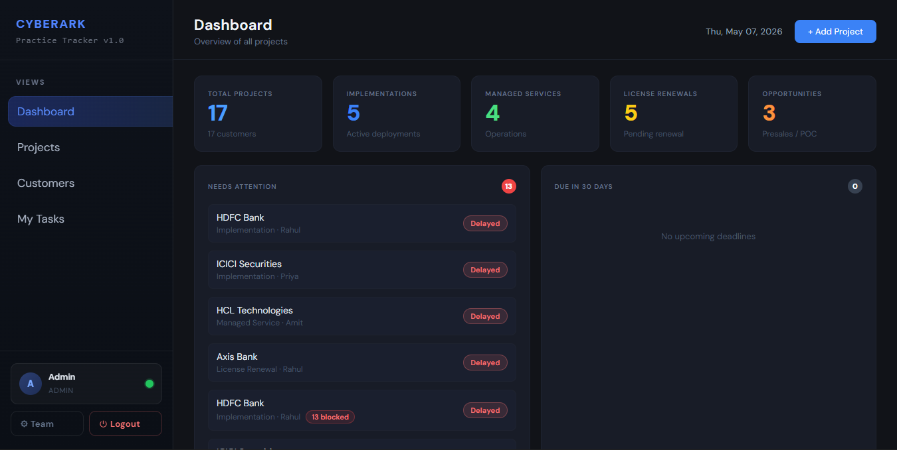
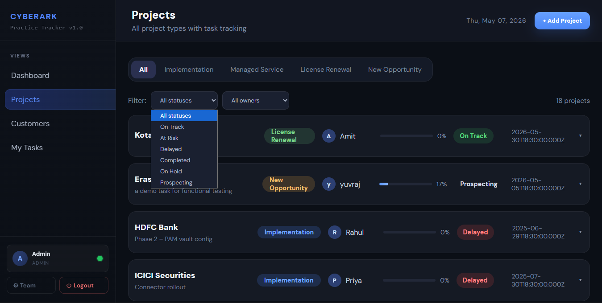
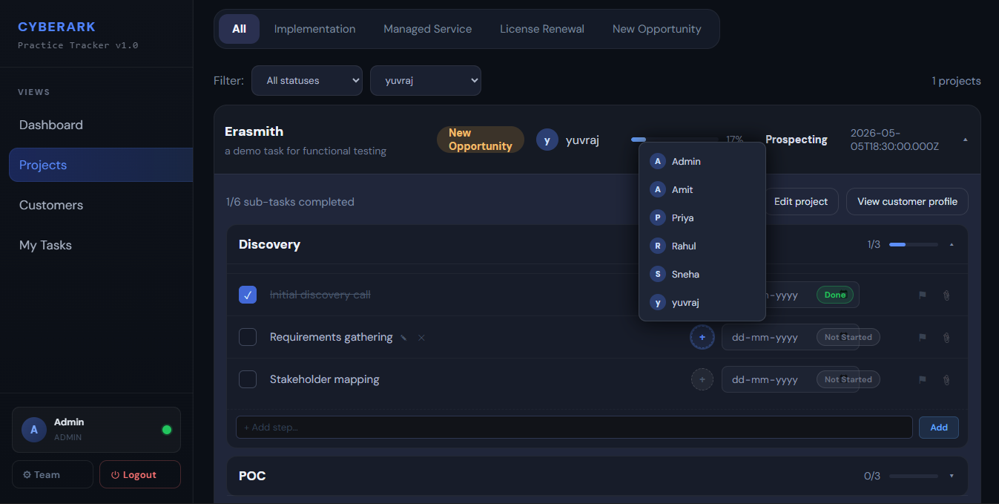
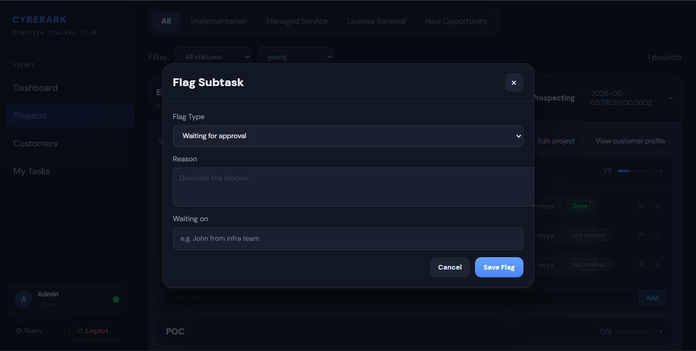
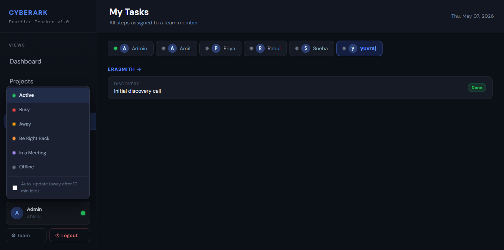
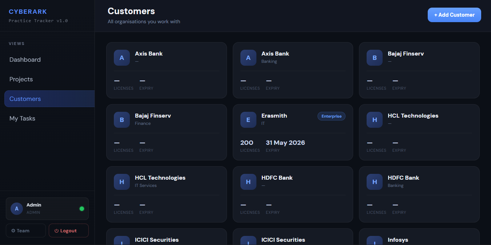
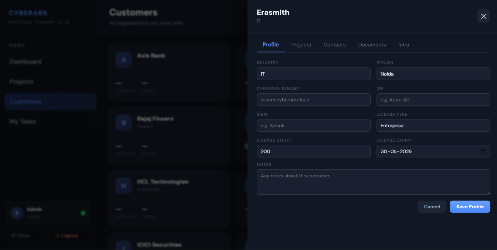
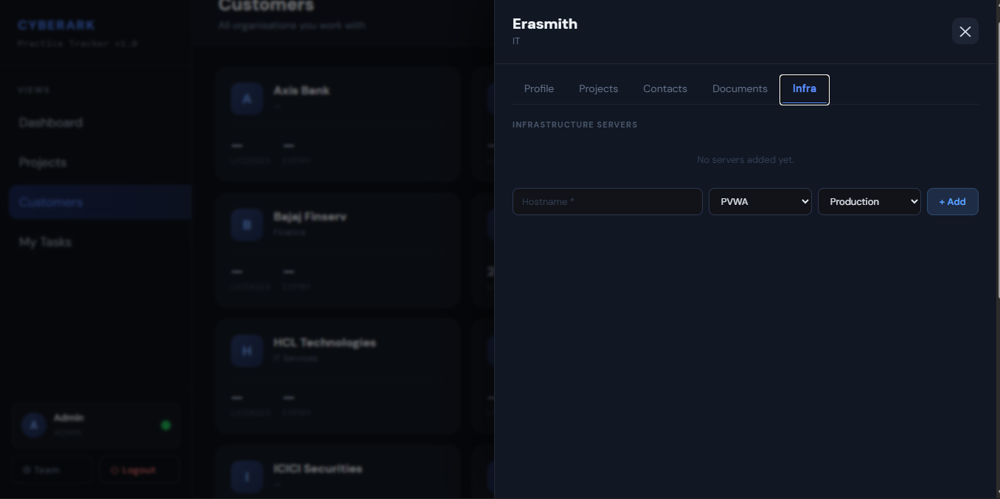
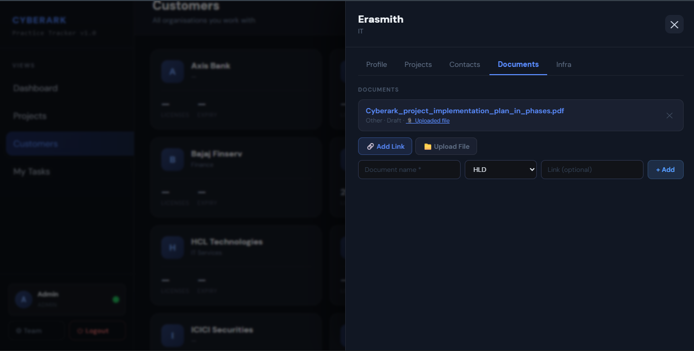
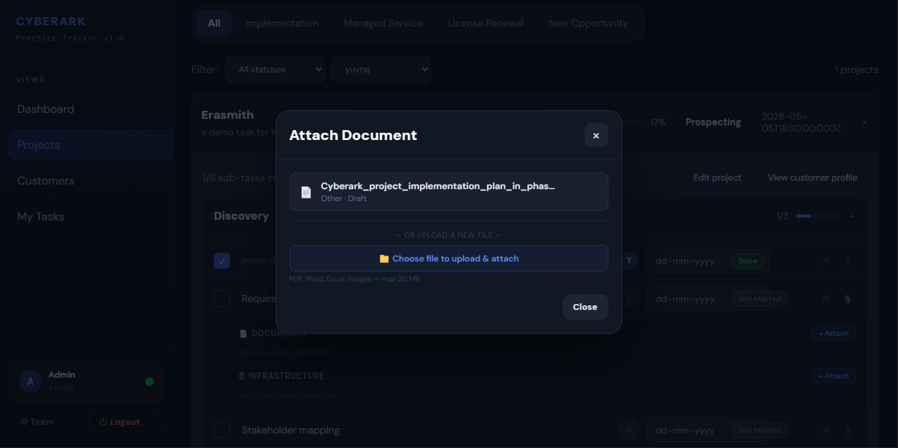

<div align="center">

# 🛡️ CyberArk Practice Tracker

[](https://react.dev)
[](https://vitejs.dev)
[](https://nodejs.org)
[](https://mysql.com)
[](LICENSE)

**A full-stack project management portal built specifically for CyberArk implementation teams.**  
Track customers, projects, tasks, infrastructure, team availability, and hours — all in one place.



</div>

---

## ✨ Features

### Core Project Management
- 🎯 **Project Pipeline** — Manage Implementations, Managed Services, License Renewals, and New Opportunities with real-time progress tracking
- 👥 **Customer Management** — Full customer profiles with contacts, infrastructure inventory, and document library
- ✅ **Task Assignment** — Granular subtask tracking with statuses: Not Started → In Progress → In Testing → Awaiting Feedback → Blocked → Done
- 🚩 **Flag & Escalation System** — Flag blocked tasks with reason, waiting-on, and flag type for instant visibility
- 📄 **Document Hub** — Upload and link HLDs, LLDs, SOPs, Architecture Diagrams, and more to any project or task
- 🖥️ **Infrastructure Registry** — Track PVWA, CPM, PSM, Vault, and Jump Server details per customer environment
- 📊 **Live Dashboard** — At-a-glance stats, "Needs Attention" alerts, and 30-day deadline view
- 🟢 **Team Availability** — Real-time online/offline status indicators for all team members
- 🔐 **Secure Auth** — Session-based auth with bcrypt, rate limiting, and protected file serving
- 🗂️ **My Tasks View** — Personal task queue filtered to the logged-in user

### Hours Tracking & Reporting *(new)*
- ⏱️ **Automatic Hour Logging** — When a subtask is marked Done, 1 hour is automatically logged to the assignee's record in `time_logs`. No manual entry required.
- 📤 **Excel Timesheet Upload Pipeline** — 4-step workflow: Download Template → Upload & Parse → Preview & Enrich → Export / Save to DB
  - **Step 1** — Download a pre-formatted `.xlsx` template with an Instructions sheet
  - **Step 2** — Upload your filled template; rows are parsed and validated instantly
  - **Step 3** — Enrich rows against the DB (DB values fill gaps; your uploaded values always win), then preview exactly what will be written before committing:
    - 🟢 New entries (will be inserted)
    - 🟡 Conflicting entries (will overwrite existing — shows existing hours and source: `app` or `excel`)
    - 🔴 Rejected rows (permission violation or unresolvable employee — shown with per-row reason)
  - **Step 4** — Download the enriched `.xlsx` (always available) and/or click **Confirm & Save** to commit to the database
- ✅ **Post-Import Summary** — After saving, a modal shows: "Imported X rows — Y new, Z overwritten, W rejected"
- 🔒 **Role-based Upload Permissions** — Members can only upload rows for themselves; Admins and Managers can upload for any employee
- 📥 **Dual Source Tracking** — Every `time_logs` entry carries a `source` field (`app` or `excel`) so you always know where hours came from
- 🔄 **Upsert Logic** — Excel uploads use `INSERT ... ON DUPLICATE KEY UPDATE` on the natural key `(employee_id, project_name, activity_group, date)` — no duplicate rows, no summing, clean overwrites

### Analytics
- 📈 **Team Utilisation** — Hours per team member now reads from the unified `time_logs` table, reflecting both app-logged and Excel-uploaded hours correctly (previously always showed 0h)
- 📉 **Task Completion by Project** — Completion percentages per project
- 🕐 **Hours per Person per Project** — Breakdown of logged hours across projects
- 🚧 **Blocked Tasks View** — All blocked/awaiting-feedback tasks with context
- 📆 **Progress Trend** — Project completion trajectory over time
- 🍩 **Status Breakdown** — Subtask status distribution across the entire portfolio
- 📅 **Hours per Day** — Activity sparkline for the last N days

---

## 📸 Screenshots

### Dashboard Overview


### Project Management


### Task Tracking & Assignment
| Task Assignment | Flag a Subtask | Task Statuses |
|---|---|---|
|  |  |  |

### Customer & Infrastructure
| Customer List | Customer Profile | Add Infrastructure |
|---|---|---|
|  |  |  |

### Documents & Context
| Document Upload | Attach Context |
|---|---|
|  |  |

---

## 🚀 Quick Start

### Prerequisites

- Node.js 18+
- MySQL 8+

### 1. Clone & Install

```bash
git clone https://github.com/your-username/cyberark-practice-tracker.git
cd cyberark-practice-tracker

# Install backend dependencies
cd backend && npm install

# Install frontend dependencies
cd ../frontend && npm install
```

### 2. Configure Environment

**Backend** — create `backend/.env`:

```env
DB_HOST=localhost
DB_PORT=3306
DB_USER=root
DB_PASSWORD=your_password
DB_NAME=project_management
SESSION_SECRET=your_secret_here
FRONTEND_URL=http://localhost:5173
PORT=4000
```

**Frontend** — create `frontend/.env`:

```env
VITE_API_URL=http://localhost:4000
```

### 3. Set Up the Database

```bash
# Create the base schema (idempotent — safe to re-run)
mysql -u root -p project_management < backend/schema.sql

# Run migrations in order
mysql -u root -p project_management < backend/migrations/001_cleanup_unused_schema.sql
mysql -u root -p project_management < backend/migrations/002_add_audit_and_notifications.sql
mysql -u root -p project_management < backend/migrations/003_create_time_logs.sql

# (Optional) Seed sample data
mysql -u root -p project_management < backend/seed.sql
```

### 4. Run

```bash
# Terminal 1 — Backend
cd backend && npm run dev

# Terminal 2 — Frontend
cd frontend && npm run dev
```

Open [http://localhost:5173](http://localhost:5173) in your browser.

---

## 🏗️ Tech Stack

| Layer | Technology |
|---|---|
| **Frontend** | React 19, Vite 8, Redux Toolkit, React Router 7 |
| **Backend** | Node.js, Express 5, express-session |
| **Database** | MySQL 8 (mysql2) |
| **Auth** | bcrypt, session cookies, rate limiting (express-rate-limit) |
| **File Uploads** | Multer (auth-protected serving) |
| **Excel Pipeline** | ExcelJS (template generation, parse, enrich, export) |
| **Dev Tools** | Nodemon, ESLint |

---

## 📁 Project Structure

```
├── backend/
│   ├── migrations/
│   │   ├── 001_cleanup_unused_schema.sql
│   │   ├── 002_add_audit_and_notifications.sql
│   │   └── 003_create_time_logs.sql        # ← hours tracking table
│   ├── src/
│   │   ├── controllers/    # Route handlers
│   │   ├── models/         # DB query layer
│   │   │   └── timeLog.model.js            # ← upsert + conflict preview
│   │   ├── routers/        # Express route definitions
│   │   ├── services/       # Business logic
│   │   │   ├── subtask.service.js          # ← auto-logs 1h on Done
│   │   │   └── timesheet.service.js        # ← Excel pipeline + conflict preview
│   │   ├── middlewares/    # Auth, error handling, uploads
│   │   └── config/         # DB pool, upload config
│   ├── schema.sql          # Full DB schema (idempotent, IF NOT EXISTS)
│   ├── seed.sql            # Sample data
│   └── server.js           # Express app entry point
└── frontend/
    └── src/
        ├── components/
        │   ├── Reports/    # ← 4-step Excel pipeline + conflict preview UI
        │   └── ...         # Dashboard, Projects, Customers, MyTasks, Users, Analytics
        ├── context/        # Auth & Error context providers
        ├── hooks/          # useAvailability
        ├── redux/          # Store + view slice
        └── api.js          # Centralised API client
```

---

## 🗄️ Database Schema Overview

| Table | Purpose |
|---|---|
| `users` | Platform users with roles (ADMIN, LEAD, MANAGER, MEMBER) |
| `user_groups` | Access control tiers (MASTER_ADMIN → MEMBER) |
| `customers` | Client organisations |
| `projects` | Belong to a customer and owner; status auto-derived from subtasks |
| `activity_groups` | Phase/stage groups within a project |
| `subtasks` | Individual work items; status drives project health |
| `subtask_log` | Audit trail for subtask field changes |
| `activity_logs` | Legacy hours log (used by report generation) |
| `time_logs` | **Unified hours ledger** — fed by app auto-log (`source='app'`) and Excel upload (`source='excel'`); natural key `(employee_id, project_name, activity_group, date)` |
| `timesheet_upload_runs` | Audit trail for Excel uploads |
| `timesheet_rows` | Parsed + enriched rows from each upload run |
| `documents` | Files/links per customer |
| `document_links` | Polymorphic join: document ↔ project/group/subtask |
| `infra_servers` | Server inventory per customer |
| `infra_links` | Polymorphic join: server ↔ project/group/subtask |

---

## 🔒 Security Highlights

- Session cookies are `httpOnly`, `secure` (in production), and `sameSite: strict`
- Auth endpoints are rate-limited (20 requests / 15 min per IP)
- File uploads are served through an authenticated endpoint — no public static access
- Path traversal protection on file serving routes
- `SESSION_SECRET` is required in production (app exits if missing)
- Role-based access enforced on all sensitive routes via `requireRole` middleware
- Excel upload permission check: Members can only submit rows for their own account; mismatched rows are rejected per-row with a clear error, never silently dropped

---

## 🤝 Contributing

Pull requests are welcome. For major changes, open an issue first to discuss what you'd like to change.

---

<div align="center">

⭐ **Star this repo if it's useful to you!** It helps others find it.

</div>
